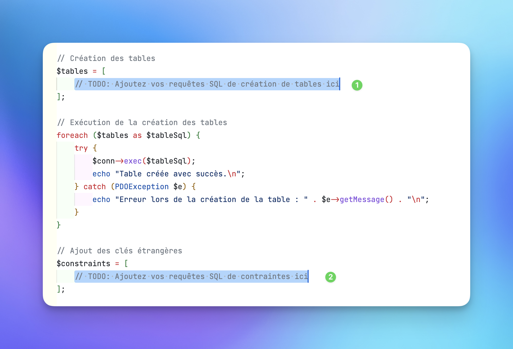

# TP SQL - 09/01/2025

Hello 👋

## Objectif du TP

- Rédiger des requêtes SQL pour créer la base de données
- Executer les requêtes SQL pour créer la base de données
- Lancer le remplissage de la base de données

## Fichiers

- `bdd.php` : Fichier PHP pour créer la base de données
- `data.php` : Fichier PHP pour remplir la base de données

## L'IA ?

Je vous recommande de ne pas utiliser l'IA pour réaliser ce TP afin de vous exercer davantage sur SQL. N'héqitez pas à vous entraider et à **documenter** votre démarche pour réaliser le TP.

Cela vous permettra d'encrer vos connaissances sur SQL.

"Je n'avais pas le choix d'utiliser l'IA ou je ne rendais rien..." = 0/20

---

## Comment rendre votre travail ?

Le TP doit être rendu dans un dépôt GitHub public avant 17h, après 17h c'est 0.
N'oubliez pas de supprimer le lien du dépôt original avec GitHub afin de pousser votre travail sur votre compte.
Envoyer le lien de votre dépôt GitHub à hello@agiliteach.org

Bon courage, et "enjoy coding" 😉